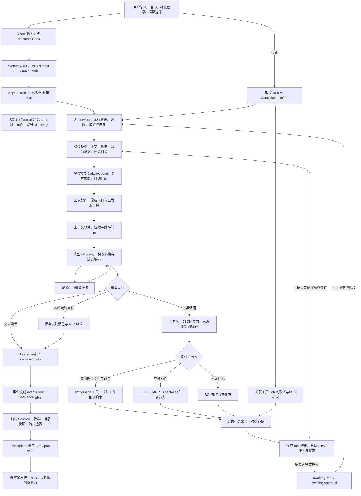
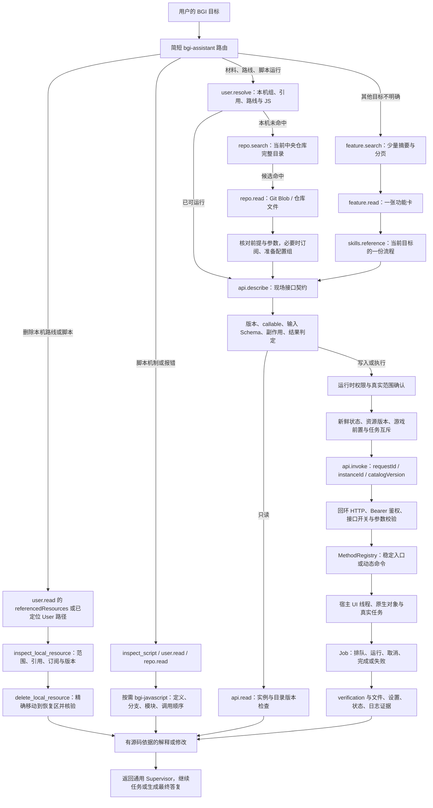
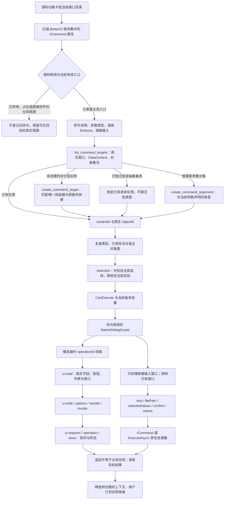
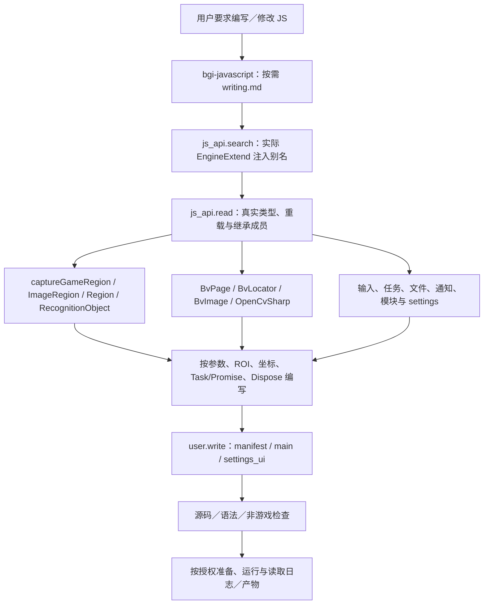
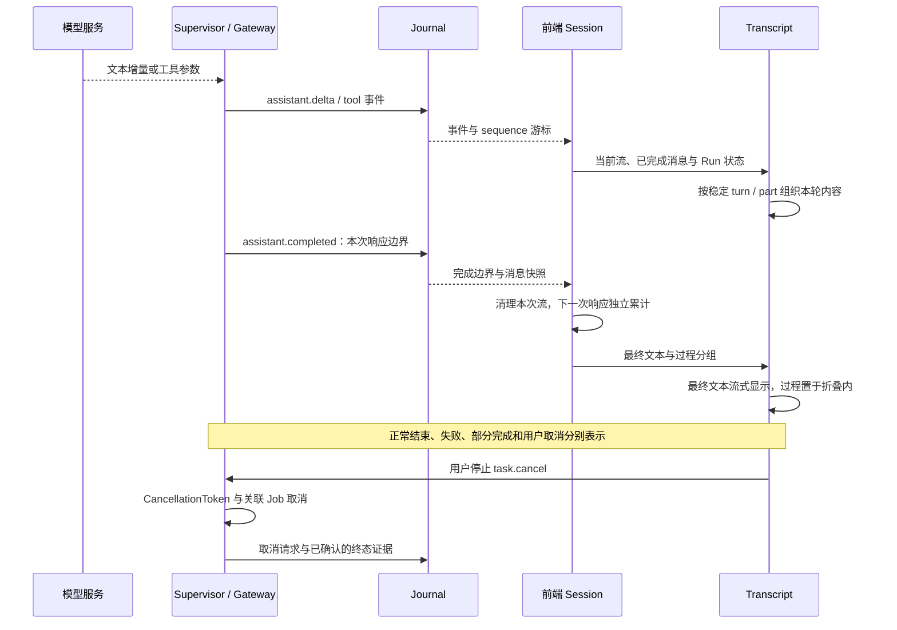

# Sleepy Doll：从用户输入到最终输出

源码事实源：`E:/BetterGIProject/Sleepy-Doll`。本文按当前代码路径描述；产品是通用游戏脚本工具 Agent，BGI 是其中一个提供方。图中的分支不要求每个请求全部经过。普通聊天可以直接回答，资源运行也不需要先加载整份功能目录。

## 总链路

实际源码入口：[前端 IPC](../../web/src/ipc/api.ts)、[桌面 IPC 接收](../../src/main.rs)、[AppController](../../src/app/mod.rs)、[Supervisor](../../src/runtime/mod.rs)、[模型 Gateway](../../src/runtime/gateway.rs)、[Journal](../../src/runtime/store/journal.rs)、[前端 Session](../../web/src/session/index.ts)、[Transcript](../../web/src/components/chat/Transcript.tsx)。

## BGI 子链路与渐进式披露

`feature-index.json` 是离线知识索引，不等于当前宿主目录，也不授予执行权限。模型不会常驻读取全部条目。明确的运行请求直接查资源，明确的 JS 问题直接读脚本；分类没有结果不能推导为全仓没有，查询失败也不能推导为不存在。

对应实现：[BGI 提供方工具](../../src/bridge/mod.rs)、[离线功能索引](../../src/bridge/features.rs)、[资源定位](../../src/bridge/resolve.rs)、[检索路由](../../src/bridge/retrieval.rs)、[运行时桥调用](../../src/runtime/host/bridge.rs)、[托管桥宿主](../../bgi-bridge/managed/Hosting/BridgeHost.cs)。

## 反射、对象、选择与弹窗链路

窗口与未注册子对象不会因为没有 `IViewModel` 标记而从目录消失。查询目录不构造窗口；构造是独立写操作。复杂对象以真实引用绑定，不能从用户 JSON 随意重建宿主对象。弹窗输入缺项、旧引用、同名多实例、错误参数和禁用命令均返回明确错误，不能把通用调用入口当绕过方式。

反射只负责定位真实对象和调用已审查的业务入口，不创造宿主未实现的业务。旧补接实现及其 implementationInput 已删除；弃用、占位和脱离真实控件的生命周期命令不发布；当前可见编辑器与模态窗口通过原生 UI 续接，不能因为需要交互就删除功能。正常路线执行走资源定位、prepare_pathing_group 和 run_script_group；截图测试使用当前原生 start_capture_test。完整逐项保留／删除结果见 [全部接口审阅表](interface-review.md)。

对应实现：[命令发现与执行](../../bgi-bridge/managed/Catalog/CommandCatalog.cs)、[目标与原生对象绑定](../../bgi-bridge/managed/Bgi/CommandTargets.cs)、[上下文接口](../../bgi-bridge/managed/Tools/CommandTargetTools.cs)、[本次弹窗输入](../../bgi-bridge/managed/Bgi/NativeDialogScope.cs)。

## JS 编写、OCR 与真实引擎契约

契约只描述真实注入、可达类型与返回对象，不创建脚本引擎、不执行 OCR 或键鼠动作。OpenCV 类型集合按具体类型分页读取，避免把全部程序集装进模型上下文。源码回退与真实类型检查明确区分。

## 输出、折叠与停止

前端渲染依据实际消息、工具关联、流式边界和 Run 状态，不能先把过程当最终答案渲染后再移动。`assistant.completed` 表示一次模型响应结束，后面仍可能继续工具流程；Job `completed` 也不自动表示用户的游戏目标完成。只有核验实际终态后才报告已完成或已停止。

## 所有权与边界

| 层 | 负责什么 |
|---|---|
| 通用 Agent | 会话、上下文、模型协议、技能与工具发现、权限、计划、预算、取消、结果输出 |
| BGI 插件／提供方 | BGI 目标路由、资源与仓库语义、功能索引、脚本理解、领域前置和核验规则 |
| Rust BGI 客户端 | 契约发现、实例与目录版本、资源校验、审批、状态新鲜度、请求幂等、Job 跟踪 |
| 托管桥 | 回环鉴权、Schema、UI 线程、反射、原生对象／选择／弹窗绑定、宿主执行与结果 |
| BGI 本体 | 游戏识别与任务算法、宿主资源、原生配置 setter、实际窗口、脚本环境、取消上下文 |
| React 界面 | 输入、任务状态、事件合并、流式文本、过程折叠与最终答复展示 |

调用链和源代码检查能核验工程连接，隔离宿主能核验参数／对象／弹窗适配；真实游戏识别、角色前提、实际收益与跨会话环境仍要现场验证。测试结果与当前已运行的桥版本分开记录，不能用新 DLL 已编译代替新版本已注入。
